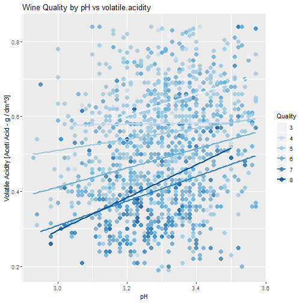

Red Wine Exploration by Prabhpreet Sandhu
========================================================


```
## 'data.frame':	1599 obs. of  13 variables:
##  $ X                   : int  1 2 3 4 5 6 7 8 9 10 ...
##  $ fixed.acidity       : num  7.4 7.8 7.8 11.2 7.4 7.4 7.9 7.3 7.8 7.5 ...
##  $ volatile.acidity    : num  0.7 0.88 0.76 0.28 0.7 0.66 0.6 0.65 0.58 0.5 ...
##  $ citric.acid         : num  0 0 0.04 0.56 0 0 0.06 0 0.02 0.36 ...
##  $ residual.sugar      : num  1.9 2.6 2.3 1.9 1.9 1.8 1.6 1.2 2 6.1 ...
##  $ chlorides           : num  0.076 0.098 0.092 0.075 0.076 0.075 0.069 0.065 0.073 0.071 ...
##  $ free.sulfur.dioxide : num  11 25 15 17 11 13 15 15 9 17 ...
##  $ total.sulfur.dioxide: num  34 67 54 60 34 40 59 21 18 102 ...
##  $ density             : num  0.998 0.997 0.997 0.998 0.998 ...
##  $ pH                  : num  3.51 3.2 3.26 3.16 3.51 3.51 3.3 3.39 3.36 3.35 ...
##  $ sulphates           : num  0.56 0.68 0.65 0.58 0.56 0.56 0.46 0.47 0.57 0.8 ...
##  $ alcohol             : num  9.4 9.8 9.8 9.8 9.4 9.4 9.4 10 9.5 10.5 ...
##  $ quality             : int  5 5 5 6 5 5 5 7 7 5 ...
```

```
##        X          fixed.acidity   volatile.acidity  citric.acid   
##  Min.   :   1.0   Min.   : 4.60   Min.   :0.1200   Min.   :0.000  
##  1st Qu.: 400.5   1st Qu.: 7.10   1st Qu.:0.3900   1st Qu.:0.090  
##  Median : 800.0   Median : 7.90   Median :0.5200   Median :0.260  
##  Mean   : 800.0   Mean   : 8.32   Mean   :0.5278   Mean   :0.271  
##  3rd Qu.:1199.5   3rd Qu.: 9.20   3rd Qu.:0.6400   3rd Qu.:0.420  
##  Max.   :1599.0   Max.   :15.90   Max.   :1.5800   Max.   :1.000  
##  residual.sugar     chlorides       free.sulfur.dioxide
##  Min.   : 0.900   Min.   :0.01200   Min.   : 1.00      
##  1st Qu.: 1.900   1st Qu.:0.07000   1st Qu.: 7.00      
##  Median : 2.200   Median :0.07900   Median :14.00      
##  Mean   : 2.539   Mean   :0.08747   Mean   :15.87      
##  3rd Qu.: 2.600   3rd Qu.:0.09000   3rd Qu.:21.00      
##  Max.   :15.500   Max.   :0.61100   Max.   :72.00      
##  total.sulfur.dioxide    density             pH          sulphates     
##  Min.   :  6.00       Min.   :0.9901   Min.   :2.740   Min.   :0.3300  
##  1st Qu.: 22.00       1st Qu.:0.9956   1st Qu.:3.210   1st Qu.:0.5500  
##  Median : 38.00       Median :0.9968   Median :3.310   Median :0.6200  
##  Mean   : 46.47       Mean   :0.9967   Mean   :3.311   Mean   :0.6581  
##  3rd Qu.: 62.00       3rd Qu.:0.9978   3rd Qu.:3.400   3rd Qu.:0.7300  
##  Max.   :289.00       Max.   :1.0037   Max.   :4.010   Max.   :2.0000  
##     alcohol         quality     
##  Min.   : 8.40   Min.   :3.000  
##  1st Qu.: 9.50   1st Qu.:5.000  
##  Median :10.20   Median :6.000  
##  Mean   :10.42   Mean   :5.636  
##  3rd Qu.:11.10   3rd Qu.:6.000  
##  Max.   :14.90   Max.   :8.000
```

This report explores the Red Wine dataset containing 12 properties of the wine.


Quality is numeric variable. Converting it to factor variable for analysis and 
adding a new variable to the dataset.

# Univariate Plots Section

Univariate plots to understand which variables are normal or 
close to normal distribution.


All there variables are normally or close to normal distriburion.


All these variables are not normally distributed.


Bar Chart for qulity.category (new column added)


Data Transformations for properties which are not normally distributed

# Univariate Analysis

### What is the structure of your dataset?

There are 1599 observations, and 11 properties of the wine. Then I converted 
quality variable to factor variable, and added a new column to the dataset. 
And then added 1 more column quality.category to the dataset. 
Observations:
1. Most of the red wine quality rating is 5/6.
2. Maximum wine quality dataset belongs to medium after categorising the 
wine quality.
3. Limited Data for other qualities.
4. Red Wine properties: fixed.acidity, volatile.acidity, density, pH, alcohol 
are close to normal distribution.
5. Red Wine properties: residual.sugar, chlorides, sulphates, citric.acid, 
free.sulfur.dioxide, total.sulfur.dioxide are not normally distributed.


### What is/are the main feature(s) of interest in your dataset?

To investigate what properties of the wine affects the rating of the wine.

### What other features in the dataset do you think will help support your \

Features like pH, alcohol, sulphates, chorides will help.

### Did you create any new variables from existing variables in the dataset?

Converted numeric variable quality to factor variable and assigned this new 
variable to qualilty.factor. 
And added quality.category variable to the dataset, based on the quality rating. 
(1-3 -> bad, 4-6 -> medium, 7-10 -> good)

### Of the features you investigated, were there any unusual distributions? \
Did you perform any operations on the data to tidy, adjust, or change the form \
of the data? If so, why did you do this?

residual.sugar, chlorides, sulphates, citric.acid, free.sulfur.dioxide, 
total.sulfur.dioxide are not normal or close to normal distribution. Converted 
these variables taking log10 to make them close to normal distribution.

# Bivariate Plots Section


Looking at these box plots, as the quantity increases better the rating of 
the wine.


Looking at these Box Plots, we can say that as the quantity decreases, 
the quality rating gets better for Red wine.


These properties doesn't seem to have any effect on the quality rating 
of the wine.


These variables have negative correlations with each other. 


These variable have positive correlation.

# Bivariate Analysis

### Talk about some of the relationships you observed in this part of the \
investigation. How did the feature(s) of interest vary with other features in \
the dataset?
Positive corelations among variables
1. fixed.acidity & density
2. fixed.acidity & citric.acid
3. pH & volatile.acidity

Negative correlation
1. pH & fixed.acidity
2. pH & citric.acid
3. pH & density
4. citric.acid & volatile.acidity
5. alcohol & density


### Did you observe any interesting relationships between the other features \
(not the main feature(s) of interest)?
There's a strong positive correlation between total.sulfur.dioxide 
& free.sulfur.dioxide.

### What was the strongest relationship you found?
Strongest positive correlation is between 
1. fixed.acidity & citric.acid
2. fixed.acidity & density
3. total.sulfur.dioxide & free.sulfur.dioxide 

# Multivariate Plots Section


```
## [1] "my_data <- select(rw, fixed.acidity, volatile.acidity, citric.acid, \n                  residual.sugar, chlorides, free.sulfur.dioxide, \n                  total.sulfur.dioxide, density, pH, sulphates, alcohol, \n                  quality)\n\ncor_1 <- cor(my_data)"
```


Now before proceeding to multivariate plots, looking at the matrix of 
correlation coefficient of all the properties with quality, following have 
strong positive correlation with quality
1. fixed.acidity
2. citric.acid
3. sulphates
4. alcohol

These were the outcome of the boxplot as well.
Now let's concentrate on the main 4 chemical properties of red wine, which were 
outcome of bivariate analysis & correlation matrix.


High alcohol & high level of citric.acid produces better quality wines.


Low Density wines & High fixed.acidity are better wine quality.


Wines with low volatile.acidity are better quality wines.


High level of sulphates with higher alcohol are better wines.


chlorides does not have any effect on the wine quality.


free.sulfur.dioxide does not have any effect on the wine quality.


## Linear model for Quality


In model m1, I add those properties which seem to have positive strong 
correlation with wine quality. F-statistic comes out to be 159 
& R-squared is 0.2862. 

Next I add those variables which seem to have negative correlation 
with wine quality to m1.
F-statistic drops to 120 & R-squared improves to 0.345.
Here density and pH seems to loose the significance.

Next adding those properties which doesn't seem to have any effect on the 
wine quality.
F-statistic falls significantly to 81 and R-squared improved to 0.3606

But the p-value for all the 3 models doesn't change.


# Multivariate Analysis

### Talk about some of the relationships you observed in this part of the \
investigation. Were there features that strengthened each other in terms of \
looking at your feature(s) of interest?

Wines with High
1. alcohol
2. sulphates
3. fixed.acidity
4. citric.acid
are better quality wines.

But
1. free.sulfur.dioxide
2. chlorides
does not have any effect on the wine quality.

Low 
1. volatile.acidity
2. density
gives better rating for wines.

moderate pH seems to produce better wines.


### Were there any interesting or surprising interactions between features?

And decreasing the quantity of chlorides seemed to have better 
quality wines in boxplots.
But multivariate plots depicted that chlorides have no effect on the 
wine quality.

### OPTIONAL: Did you create any models with your dataset? Discuss the \
strengths and limitations of your model.

created 3 linear models for the dataset with 11 datapoints
1. alcohol + fixed.acidity + sulphates + citric.acid
2. alcohol + fixed.acidity + sulphates + citric.acid + volatile.acidity + pH
3. alcohol + fixed.acidity + sulphates + citric.acid + volatile.acidity + pH + 
residual.sugar + chlorides + free.sulfur.dioxide + total.sulfur.dioxide + 
density
 
Since he dataset has majority of the wines in medium group, there's very 
limited data for bad (1-4) and good (7-10) quality wines, it doesn't seem to 
predict properly. If we have more data for these quality wines then it would 
be a better predicting model.

------

# Final Plots and Summary

### Plot One


### Description One
This Chart clearly depicts that wines with high citric.acid & high alcohol 
wines are better wines.

### Plot Two


### Description Two
This plot clearly depicts high alcohol levels and high sulphates levels produce 
better quality wines.

### Plot Three


### Description Three
Wines with low volatile acidity combined with moderate pH values are better wines.

------

# Reflection
1. High Alcohol content, is important for better wine qulaity ratings.
2. High Sulphates are the next important property for better quality wines.
3. Increased citric.acid & fixed.acidity have positive correlation with wine 
quality.
4. Moderate pH levels are better quality wines.
5. Density, chlorides, residual.sugar, free.sulfur.dioxide & 
total.sulfur.dioxide doesn't seem to have big effect on the wine qulaity.
6. Low volatile.acidity seems to have positive effect on wine quality.

Since the dataset is limited to the majority of the medium quality wines, 
it was hard to depict what properties would have played important role in 
determining the quality of the red wine.

When fitted linear model with all the variables, citric.acid and fixed.acidity 
lost the significance but for other 2 linear models m1 & m2, these are important 
properties to consider.

In linear model m3, about 35% of the variance in quality of wine is explained by 
all the properties of the wine in dataset.
If we have more data on the extreme quality wines bad, good than we predict a 
better linear model. And some other sophisticated models can be used 
to better understand what chemical properties make a wine better quality wines.
